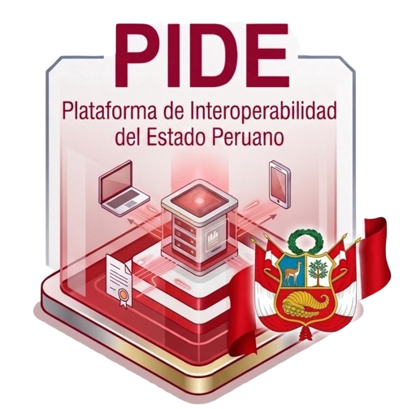

<p align="center">
    
</p>

# Sistema de Consultas PIDE — v2.0

> Plataforma de Interoperabilidad del Estado Peruano (PIDE) para la consulta de información de personas, contribuyentes y predios, desarrollada para la **Municipalidad Distrital de El Tambo**.

**Versión 2.0** — Migración completa del proyecto a **Laravel 10** con **Livewire 3**. Esta versión sustituye al sistema legado en PHP puro por una aplicación moderna SPA (Single Page Application) con componentes reactivos, gestión de usuarios, roles y módulos desde el propio sistema.

---

## ✨ Características

- **Consultas PIDE** a través de los servicios de interoperabilidad del Estado:
  - **RENIEC** — Consulta por DNI.
  - **SUNAT** — Consulta por RUC.
  - **SUNARP** — Consulta de partidas registrales (titular / jurídica).
  - Modo *demo* automático cuando no se configuran credenciales PIDE.
- **Generación de reportes en PDF** de las consultas (`barryvdh/laravel-dompdf`).
- **Gestión de usuarios, roles y módulos** desde el panel (asignación por rol, permisos por módulo).
- **Centro de Ayuda** dinámico que muestra documentación según los módulos asignados al rol.
- **Cambio de contraseña** en sitio, auditoría, iconoteca para módulos y navegación colapsable.
- Interfaz tipo **SPA** con Livewire 3, Alpine.js y diseño propio sobre el estilo `modulo-legacy`.

## 🧰 Stack tecnológico

| Tecnología | Versión |
|---|---|
| PHP | ^8.1 |
| Laravel Framework | 10.50.x |
| Livewire (incluye Volt) | 3.8.x |
| MySQL | 5.7 / 8.x (compatible con XAMPP) |
| Node.js + Vite | ^5 |
| Tailwind CSS | ^3.1 |
| Alpine.js | incluido con Livewire |
| SweetAlert2 | ^11 |
| dompdf | v3.1 |
| Guzzle HTTP | ^7 |
| Laravel Sanctum | ^3 |
| Font Awesome | 6.x (Free / Pro) |

---

## 📋 Requisitos previos

Antes de instalar, asegúrate de contar con:

- **PHP 8.1+** (8.2 / 8.3 recomendados). Extensiones requeridas:
  - `pdo_mysql`, `mbstring`, `openssl`, `fileinfo`, `curl`, `zip`
  - `gd`, `dom`, `xml`, `ctype`, `json`, `bcmath`
- **Composer 2.x** (descargar desde [getcomposer.org](https://getcomposer.org)).
- **Node.js 18+** y **npm** (descargar desde [nodejs.org](https://nodejs.org)).
- **MySQL 5.7+ o MariaDB 10.3+** (ej. vía XAMPP 8.1).
- **Extensión `mod_rewrite`** activada en Apache (la trae XAMPP por defecto).
- **Git** para clonar el repositorio.

> **Para Windows / XAMPP 8.1**: edita `C:\xampp\php\php.ini` y descomenta las líneas:
> ```ini
> extension=gd
> extension=zip
> extension=curl
> extension=openssl
> extension=fileinfo
> extension=mbstring
> extension=pdo_mysql
> extension=mysqli
> extension=exif
> extension=intl
> ```

---

## 🚀 Instalación — guía completa

> 📌 **Resumen de pasos**: clonar → composer install → configurar `.env` → generar APP_KEY → npm install → FontAwesome → publicar assets → migrar y seedear → storage:link → npm build → ejecutar.

### 1. Clonar el repositorio

```bash
git clone <URL_DE_TU_REPOSITORIO_GITHUB> SCPIDE
cd SCPIDE
```

O si ya descargaste el `.zip`: extrae el contenido en la carpeta final y ábrela en terminal.

### 2. Instalar dependencias de PHP (Composer)

```bash
composer install --no-interaction
```

> En **producción / hosting** usa:
> ```bash
> composer install --no-dev --optimize-autoloader --no-interaction
> ```
> Esto no instala paquetes de desarrollo (PHPUnit, Pint, Sail…) y optimiza el autoloader.

### 3. Archivo de entorno `.env`

```bash
cp .env.example .env
```

En Windows PowerShell si `cp` no funciona:
```powershell
Copy-Item .env.example .env
```

#### 3.1 Valores MÍNIMOS a editar en `.env`

```dotenv
# ============================================================
# APP
# ============================================================
APP_NAME="Sistema PIDE - El Tambo"
APP_ENV=local
APP_DEBUG=true
APP_URL=http://localhost/SCPIDE
ASSET_URL=

# ============================================================
# BASE DE DATOS
# ============================================================
DB_CONNECTION=mysql
DB_HOST=127.0.0.1
DB_PORT=3306
DB_DATABASE=dbsys_pide
DB_USERNAME=root
DB_PASSWORD=tu_contraseña_mysql

# ============================================================
# PIDE (credenciales institucionales — opcionales para demo)
# ============================================================
PIDE_RUC_EMPRESA=
PIDE_URL_RENIEC=
PIDE_URL_SUNAT=
PIDE_URL_SUNARP=
PIDE_GOFICINA=
PIDE_SUNARP_USUARIO=
PIDE_SUNARP_PASS=

# ============================================================
# OTROS
# ============================================================
LOG_LEVEL=debug
SESSION_DRIVER=file
CACHE_DRIVER=file
QUEUE_CONNECTION=sync
FILESYSTEM_DISK=local
```

> 🔑 **`APP_URL` y `ASSET_URL`** — muy importantes:
> - Local con XAMPP sin vhost: `APP_URL=http://localhost/SCPIDE` (NO lleve `/public` — el `.htaccess` raíz ya hace rewrite)
> - Local con `php artisan serve`: `APP_URL=http://localhost:8000`
> - Producción dominio raíz: `APP_URL=https://tudominio.gob.pe`
> - Producción subdirectorio: `APP_URL=https://tudominio.gob.pe/sistema` Y además configura `ASSET_URL=https://tudominio.gob.pe/sistema`

#### 3.2 Generar clave de aplicación

```bash
php artisan key:generate
```

Esto escribe automáticamente `APP_KEY=base64:…` en `.env`. **Nunca compartas este valor.**

### 4. Dependencias de frontend (npm)

```bash
npm install
```

Esto instala Tailwind, Vite, SweetAlert2, axios y laravel-vite-plugin.

### 5. 🔴 Instalar Font Awesome — **OBLIGATORIO**

⚠️ Font Awesome **no está incluido en el repositorio** (está excluido por `.gitignore`). Debes instalarlo manualmente UNA SOLA VEZ después del clone. Existen 3 métodos:

#### Método A) npm — recomendado para producción

```bash
npm install @fortawesome/fontawesome-free@^6.5 --save-dev
```

Ahora copia la carpeta completa al directorio público (Windows PowerShell):
```powershell
# Crear el directorio destino
New-Item -ItemType Directory -Force -Path public\assets\css\fontawesome | Out-Null

# Copiar el contenido del paquete
Copy-Item -Recurse -Force node_modules\@fortawesome\fontawesome-free\* public\assets\css\fontawesome\
```

Linux/macOS / Git Bash:
```bash
mkdir -p public/assets/css/fontawesome
cp -r node_modules/@fortawesome/fontawesome-free/* public/assets/css/fontawesome/
```

#### Método B) Descarga manual

1. Ingresa a [fontawesome.com/download](https://fontawesome.com/download)
2. Descarga "Free for Web" (v6.x)
3. Descomprime el `.zip`
4. Copia TODO el contenido de la carpeta descomprimida en:
   ```
   SCPIDE/public/assets/css/fontawesome/
   ```

Debe quedar esta estructura:
```
public/assets/css/fontawesome/
  ├── css/
  │   ├── all.min.css
  │   ├── fontawesome.min.css
  │   └── ...
  ├── js/
  ├── webfonts/
  │   ├── fa-brands-400.woff2
  │   ├── fa-regular-400.woff2
  │   └── fa-solid-900.woff2
  ├── svgs/
  ├── sprites/
  ├── metadata/
  ├── scss/
  └── LICENSE.txt
```

#### Método C) CDN (solo desarrollo rápido — NO RECOMENDADO para producción)

Edita `resources/views/layouts/app.blade.php` y `resources/views/layouts/guest.blade.php`.
En el `<head>`, reemplaza la línea:
```blade
<link rel="stylesheet" href="{{ asset('assets/css/fontawesome/css/all.min.css') }}">
```
por:
```blade
<link rel="stylesheet" href="https://cdnjs.cloudflare.com/ajax/libs/font-awesome/6.5.0/css/all.min.css">
```

---

### 6. Publicar assets de paquetes (vendor:publish) — **OBLIGATORIO**

Algunos paquetes (Laravel Framework, Livewire) necesitan publicar sus JS/CSS en `public/vendor/`. Ejecuta:

```bash
php artisan vendor:publish --tag=laravel-assets --ansi --force
```

Esto copia los archivos necesarios en:
- `public/vendor/livewire/` (Livewire JS `livewire.min.js`, `livewire.esm.js`, `manifest.json`)

> Si después de este paso el sistema muestra error 404 o Livewire no carga, ejecuta adicionalmente:
> ```bash
> php artisan livewire:publish --assets
> php artisan vendor:publish --tag=livewire:config
> ```

### 7. Crear la base de datos MySQL

Antes de migrar, crea manualmente la base de datos en phpMyAdmin o consola:

```sql
CREATE DATABASE IF NOT EXISTS dbsys_pide
  DEFAULT CHARACTER SET utf8mb4
  DEFAULT COLLATE utf8mb4_unicode_ci;
```

En XAMPP: abre [http://localhost/phpmyadmin/](http://localhost/phpmyadmin/) → Nueva → nombre `dbsys_pide` → cotejamiento `utf8mb4_unicode_ci` → Crear.

### 8. Migrar y poblar datos iniciales

```bash
php artisan migrate --seed
```

Esto:
- Crea todas las tablas (usuarios, roles, módulos, personas, historial_auditoria, sesiones, cat_estados, iconos, sistemas…)
- Inserta datos de `database/seeders/data/*.json`:
  - 5 iconos iniciales
  - Módulos del sistema
  - Roles `ADMIN`, `PRAC`, `EMP`, `VIS`
  - Usuarios de prueba (incluido `admin`)
  - Sistema PIDE base
  - Personas y asignaciones

> Si necesitas **reiniciar desde cero** la BD (borra TODO y vuelve a poblar):
> ```bash
> php artisan migrate:fresh --seed
> ```

### 9. 🔗 Enlace simbólico de storage — **OBLIGATORIO**

```bash
php artisan storage:link
```

Crea `public/storage/` → apunta a `storage/app/public/`. Necesario para PDFs, imágenes subidas por usuarios, archivos temporales.

> En **cPanel / hosting compartido** si `storage:link` falla (por restricciones de symlink), crea manualmente el archivo `public/storage` como un `Junction` / enlace duro o sube los archivos directamente. Alternativa: añade en `routes/web.php` una ruta fallback de archivos storage o usa el disco `public` como URL relativa.

### 10. Compilar assets de producción (Vite build)

```bash
npm run build
```

Genera:
- `public/build/assets/app-XXXXXXXX.css`
- `public/build/assets/app-XXXXXXXX.js`
- `public/build/manifest.json`

> Para **desarrollo** (recarga en caliente):
> ```bash
> npm run dev
> ```
> Deja esa terminal abierta y abre otra para `php artisan serve` o Apache.

---

## 🌐 Ejecutar — 3 formas posibles

### ▶️ Opción 1: `php artisan serve` (desarrollo rápido)

```bash
php artisan serve
```

Abre: **http://localhost:8000/login**

### ▶️ Opción 2: XAMPP — htdocs (sin vhost)

1. Coloca la carpeta `SCPIDE` dentro de `C:\xampp\htdocs\`
2. Verifica Apache y MySQL activos en el panel de XAMPP
3. Abre: **http://localhost/SCPIDE/login**

> ✅ El proyecto ya trae un `.htaccess` en la **raíz** que reescribe TODAS las peticiones hacia `/public/` de forma transparente. No necesitas cambiar DocumentRoot ni crear VirtualHost.

> ❗ Si el login no carga estilos CSS, revisa que `APP_URL` en `.env` sea `http://localhost/SCPIDE` (sin `/public` final) y luego ejecuta:
> ```bash
> php artisan config:clear
> php artisan route:clear
> php artisan view:clear
> php artisan cache:clear
> npm run build
> ```

### ▶️ Opción 3: XAMPP — VirtualHost (URL personalizada tipo `scpide.local`)

Edita `C:\xampp\apache\conf\extra\httpd-vhosts.conf`:
```apache
<VirtualHost *:80>
    ServerName scpide.local
    DocumentRoot "C:/xampp/htdocs/SCPIDE/public"
    <Directory "C:/xampp/htdocs/SCPIDE/public">
        AllowOverride All
        Require all granted
        Options Indexes FollowSymLinks
    </Directory>
    ErrorLog "logs/scpide-error.log"
    CustomLog "logs/scpide-access.log" common
</VirtualHost>
```

Edita `C:\Windows\System32\drivers\etc\hosts` (como Administrador):
```
127.0.0.1  scpide.local
```

Reinicia Apache. Abre: **http://scpide.local/login**

Y en `.env`:
```dotenv
APP_URL=http://scpide.local
ASSET_URL=
```

---

## 🔑 Acceso inicial — credenciales

Roles creados por el seeder:

| Código | Nombre | Descripción |
|---|---|---|
| `ADMIN` | Administrador | Acceso TOTAL a todos los módulos |
| `PRAC` | Practicante | Acceso limitado a módulos de consulta |
| `EMP` | Empleado | Acceso estándar a módulos asignados |
| `VIS` | Visitante | Solo vista mínima |

### Usuario administrador por defecto

```text
👤 Usuario : admin
🔑 Clave   : (definida en database/seeders/data/usuario.json)
```

Si desconoces la clave o deseas resetearla:
```bash
php artisan tinker --execute="App\Models\Usuario::where('username','admin')->first()?->update(['password_hash' => Illuminate\Support\Facades\Hash::make('NuevaClave123')]);"
```

O usa el seeder directamente: edita `database/seeders/data/usuario.json`, busca el objeto `"username":"admin"` y vuelve a ejecutar `php artisan migrate:fresh --seed`.

---

## 🔌 Credenciales PIDE (RENIEC / SUNAT / SUNARP)

Sin credenciales el sistema funciona en **MODO DEMOSTRATIVO** (los resultados llevan la leyenda *"Dato demostrativo"*). Para consultas reales configura en `.env`:

```dotenv
# -----------------------------------------------------------
# Datos institucionales de la entidad
# -----------------------------------------------------------
PIDE_RUC_EMPRESA=20XXXXXXXXX

# URLs oficiales del entorno PIDE Producción o Certificación
PIDE_URL_RENIEC="https://ws2.pide.gob.pe/Rest/RENIEC/Consultar?out=json"
PIDE_URL_SUNAT="https://ws3.pide.gob.pe/Rest/Sunat"
PIDE_URL_SUNARP="https://ws2.pide.gob.pe/Rest/SUNARP"
PIDE_GOFICINA="https://ws2.pide.gob.pe/Rest/SUNARP/GOficina?out=json"

# Credenciales SUNARP (solicitar a la OATA)
PIDE_SUNARP_USUARIO="RUC-CODIGO"
PIDE_SUNARP_PASS="TU_PASSWORD"
```

> 🛡️ **Nunca subas `.env` al repositorio.** Está protegido por `.gitignore`. Si lo subiste por error, cambia todas las credenciales inmediatamente y purga el historial con `git filter-repo`.

---

## 🖥️ Despliegue en hosting compartido / cPanel

1. **Sube los archivos** (excepto `node_modules` y `vendor`) vía FTP / Git:
   ```bash
   # En local, genera un paquete limpio para subir sin dependencias:
   git archive -o scpide-latest.zip HEAD
   ```
2. **Crea la base de datos** en cPanel (MySQL Databases) y agrega usuario con permisos ALL.
3. **Importa la estructura** (desde local usa `php artisan schema:dump` o exporta `.sql` desde phpMyAdmin).
4. **Sube `.env` editado** con los datos de cPanel (DB, APP_URL, credenciales PIDE).
5. **Instala dependencias** vía terminal SSH de cPanel:
   ```bash
   cd ~/public_html
   composer install --no-dev --optimize-autoloader --no-interaction
   ```
6. **Publica assets y corre migraciones**:
   ```bash
   php artisan config:cache
   php artisan route:cache
   php artisan view:cache
   php artisan event:cache
   php artisan vendor:publish --tag=laravel-assets --ansi --force
   php artisan migrate --force
   ```
7. **Copia FontAwesome** (descárgalo localmente y súbelo por FTP a `public/assets/css/fontawesome/`).
8. **Optimiza permisos** (si cPanel es Linux):
   ```bash
   chmod -R 755 storage bootstrap/cache
   chmod -R 775 storage bootstrap/cache    # si corre bajo usuario diferente al webserver
   ```

### Si el hosting NO te deja cambiar el document root a `public/`

✅ Ya tienes `.htaccess` en la **raíz** del proyecto que reescribe hacia `/public/`. Solo sube todo el proyecto a `public_html/` y accede normal al dominio.

Alternativa manual si por algún motivo el `.htaccess` raíz no funciona: crea un `public_html/.htaccess` adicional:
```apache
<IfModule mod_rewrite.c>
    RewriteEngine On
    RewriteRule ^(.*)$ public/$1 [L]
</IfModule>
```

---

## 🛠️ Comandos útiles — listado completo

| Comando | Descripción |
|---|---|
| **Desarrollo y build** | |
| `npm run dev` | Servidor Vite en modo desarrollo (HMR) |
| `npm run build` | Compila CSS / JS de producción en `public/build/` |
| **Cache y optimización** | |
| `php artisan cache:clear` | Borra caché de la aplicación |
| `php artisan config:clear` | Borra caché de configuración |
| `php artisan route:clear` | Borra caché de rutas |
| `php artisan view:clear` | Borra vistas compiladas Blade |
| `php artisan event:clear` | Borra caché de eventos |
| `php artisan clear-compiled` | Limpia clases compiladas |
| `php artisan optimize:clear` | **TODO en uno** (el más usado después de editar `.env`) |
| **Para PRODUCCIÓN (genera cachés de velocidad)** | |
| `php artisan config:cache` | Cachea config (importante: NO usar en desarrollo!) |
| `php artisan route:cache` | Cachea rutas |
| `php artisan view:cache` | Pre-compila vistas Blade |
| `php artisan event:cache` | Cachea eventos y listeners |
| `php artisan optimize` | Ejecuta config:cache + route:cache |
| **Base de datos** | |
| `php artisan migrate` | Ejecuta migraciones pendientes |
| `php artisan migrate:fresh --seed` | **Borra TODO y regenera** (solo dev!) |
| `php artisan db:seed` | Vuelve a ejecutar seeders |
| `php artisan schema:dump --prune` | Genera `database/schema/mysql-schema.sql` y borra migraciones antiguas |
| **Assets y enlaces** | |
| `php artisan storage:link` | Crea enlace `public/storage` → `storage/app/public` |
| `php artisan vendor:publish --tag=laravel-assets --force` | Publica JS/CSS de vendor (Livewire, etc.) en `public/vendor/` |
| `php artisan livewire:publish --assets` | Publica assets de Livewire de forma explícita |
| **Tests y QA** | |
| `php artisan test` | Ejecuta suite PHPUnit |
| `php artisan test --coverage` | Tests + reporte de cobertura (necesita PCOV / Xdebug) |
| `./vendor/bin/pint` | Formatea código con Laravel Pint |
| `php artisan tinker` | Consola interactiva REPL |
| **Seguridad y limpieza** | |
| `php artisan auth:clear-resets` | Limpia tokens expirados de reseteo de contraseña |
| `php artisan down` | Pone sitio en mantenimiento (503) |
| `php artisan up` | Saca de mantenimiento |
| `php artisan key:generate` | Genera nueva `APP_KEY` (⚠️ invalida datos encriptados existentes!) |

> 🚨 **Regla de oro en desarrollo**: si algo no toma tus cambios (`.env`, config, rutas, vistas) corre:
> ```bash
> php artisan optimize:clear
> ```

---

## 🧪 Tests

```bash
php artisan test
```

Cubre: autenticación, consultas PIDE (fallback a demo sin credenciales), gestión de usuarios / roles / módulos, cambio de contraseña, filtrado por rol del Centro de Ayuda.

Para ver que archivos contiene la suite: `tests/Feature/` y `tests/Unit/`.

---

## 📁 Estructura de carpetas relevantes

```
SCPIDE/
├── app/
│   ├── Http/Controllers/        Controladores HTTP (Dashboard, PDF, auth)
│   ├── Livewire/                ⚛️ Componentes Livewire (consultas, gestión, modales...)
│   ├── Models/                  📊 Modelos Eloquent (Usuario, Rol, Modulo...)
│   ├── Services/Pide/           Clientes HTTP RENIEC, SUNAT y SUNARP
│   ├── Support/                 Navegación del dashboard / árbol de módulos
│   └── View/Components/         <x-app-layout>, <x-guest-layout>, <x-icon>
├── bootstrap/cache/             Autoloads y cachés (NO subir a git)
├── config/                      Todos los configs de Laravel + pide.php
├── database/
│   ├── seeders/
│   │   └── data/                Datos de siembra en JSON (icono, modulo, rol, usuario...)
│   └── factories/
├── public/                      🌐 Document root real
│   ├── .htaccess                Rewrite + seguridad + compresión + caché
│   ├── assets/
│   │   ├── css/
│   │   │   ├── fontawesome/     ⚠️ NO en git — Instalar! (paso 5)
│   │   │   ├── fonts.css        Fuente Inter
│   │   │   └── login.css
│   │   ├── fonts/inter/         Fuentes Inter (woff2)
│   │   └── images/              Logo, logo_pide, muni2, dniGuiCUI
│   ├── build/                   ⚠️ NO en git — Generado por `npm run build`
│   ├── vendor/livewire/         ⚠️ NO en git — Generado por `vendor:publish`
│   ├── favicon.ico
│   ├── index.php                Front controller de Laravel
│   └── robots.txt
├── resources/
│   ├── css/app.css              Tailwind + bloque .modulo-legacy
│   ├── js/app.js, bootstrap.js, alerts.js, legacy-ui.js
│   └── views/
│       ├── layouts/             app.blade.php, guest.blade.php (🔗 cargan FontAwesome)
│       ├── components/
│       ├── livewire/            Vistas Blade de cada componente Livewire
│       └── pdf/dni.blade.php
├── routes/                      web.php (SPA), auth.php, api.php, console.php, channels.php
├── storage/                     ⚠️ NO subir su contenido — solo .gitignore
│   ├── app/public/              ← apunta el enlace public/storage
│   ├── framework/{views,cache,sessions,testing}/
│   └── logs/laravel.log
├── tests/                       PHPUnit Feature / Unit
├── vendor/                      ⚠️ NO en git — Composer
├── node_modules/                ⚠️ NO en git — npm
├── .env                         ⚠️ ¡NUNCA subir! — datos sensibles
├── .env.example                 Plantilla .env (SI se sube)
├── .gitignore                   Reglas de exclusión git
├── .gitattributes               Line endings + export-ignore
├── .htaccess                    ✅ Rewrite a /public para htdocs/cPanel
├── server.php                   Entry point para `php -S` / artisan serve
├── composer.json, composer.lock
├── package.json, package-lock.json
├── vite.config.js, tailwind.config.js, postcss.config.js
└── phpunit.xml
```

---

## 🔍 Troubleshooting común — FAQ

### 1. Pantalla en blanco / 500 Server Error
- Verifica permisos `storage/` y `bootstrap/cache/` → `775`
- Revisa `storage/logs/laravel.log`
- Corré `php artisan optimize:clear`
- En `.env` pon `APP_DEBUG=true` y `APP_ENV=local`

### 2. Error 404 al entrar a `http://localhost/SCPIDE/`
- Verifica `mod_rewrite` activado en Apache (XAMPP lo trae activo)
- En `httpd.conf` debe decir `AllowOverride All` para el directorio htdocs
- Verifica que existan ambos `.htaccess`: raíz y `public/.htaccess`
- Si no, cambia temporalmente la URL a `http://localhost/SCPIDE/public/login` y revisa el `.htaccess` raíz

### 3. Estilos / CSS no cargan (pantalla "rota" sin diseño)
- Asegúrate de ejecutar `npm run build` — genera `public/build/`
- Revisa `APP_URL` y `ASSET_URL` en `.env` sean correctos
- Corré `php artisan config:clear`
- Verifica que el archivo `public/build/manifest.json` exista

### 4. Iconos no aparecen (cuadrados / `fa-*` sin pintar)
- ❌ Falta FontAwesome. Repite el **paso 5** de instalación.
- Asegúrate de que `public/assets/css/fontawesome/webfonts/fa-solid-900.woff2` exista.
- Si usas CDN, verifica conexión a internet y que el `<link>` en los layouts esté correcto.

### 5. Livewire no responde (modales no abren, tablas no filtran, botones no reaccionan)
- Abre DevTools → Console: debe aparecer `⚡ Livewire: loaded`
- Si no: ejecuta `php artisan vendor:publish --tag=laravel-assets --ansi --force`
- Verifica existencia de `public/vendor/livewire/livewire.min.js`
- Corré `php artisan optimize:clear`

### 6. No puedo iniciar sesión — "Credenciales incorrectas"
- Asegúrate de correr `php artisan migrate --seed` (crea el usuario `admin`)
- Resetea la contraseña con el comando Tinker del paso "Acceso inicial"
- Verifica que la tabla `usuarios` tenga registros

### 7. Subí el proyecto a hosting y todo rutea a `/public` en la URL
- El `.htaccess` raíz debe estar subido con los archivos
- Si usaste Git para subir, verifica que `.htaccess` no esté en `.gitignore` (NO está excluido)
- En hosting, los archivos que empiezan con `.` son ocultos — en FileZilla / FTP habilita "Show hidden files"

### 8. Consultas PIDE siempre muestran "Dato demostrativo"
- Las credenciales en `.env` están vacías o son incorrectas → modo demo normal
- Verifica conectividad de salida hacia `*.pide.gob.pe` (algunos hostings bloquean puertos 443 salientes o requieren habilitar en "Allow URL fopen")
- Habilita `LOG_LEVEL=debug` y mira `storage/logs/laravel.log` para ver el detalle de cada petición Guzzle

---

## 📝 Notas finales

- **Sobre el legado**: la v1 (PHP clásico) se conserva únicamente como referencia histórica en proyectos anteriores. Este repositorio ya es 100% Laravel 10 + Livewire 3.
- **Modo demostrativo**: no requiere credenciales PIDE, ni internet, ni claves externas. Útil para testing y desarrollo.
- **Backup de BD**: antes de ejecutar `migrate:fresh` en staging/producción haz una exportación SQL.
- **Seguridad en producción**:
  - Cambia inmediatamente la clave `admin`
  - Pon `APP_ENV=production` y `APP_DEBUG=false`
  - Configura `SESSION_SECURE_COOKIE=true` si usas HTTPS
  - Corre `composer install --no-dev` y `php artisan optimize`

---

## 🤝 Soporte

Para errores, mejoras o consultas: abre un issue en el repositorio GitHub o contacta al área de sistemas de la Municipalidad Distrital de El Tambo.
